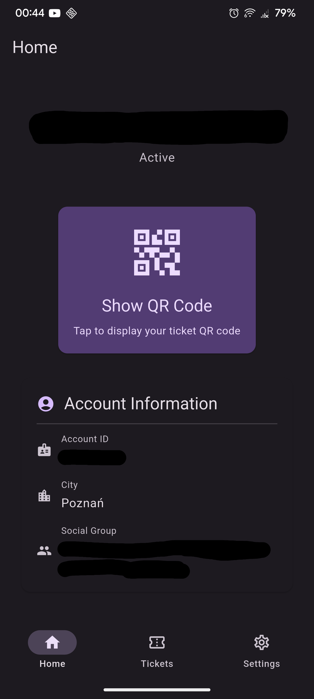
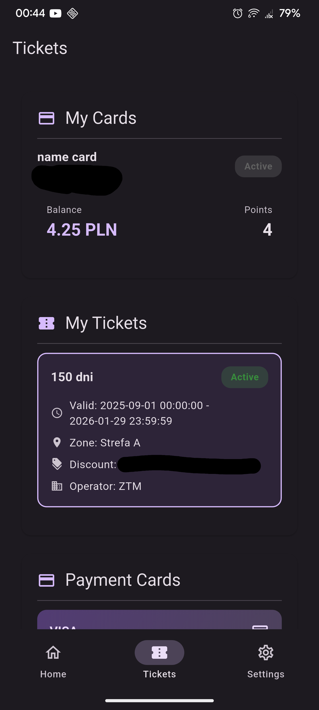

# pekky

>[!NOTE]
> This project is not affiliated with or endorsed by PEKA or ZTM.  
> This software is provided "as is" without any warranties.  
> USE AT YOUR OWN RISK, THIS IS EXPERIMENTAL SOFTWARE.

An alternative client for the PEKA public transit card system used in Poznań.  
All reverse engineered from the official PEKA app, made in one night.

## Features
- View your cards and balances
- View your tickets and their validity
- View your ticket QR code

## Screenshots

   
Click to reveal!

    

